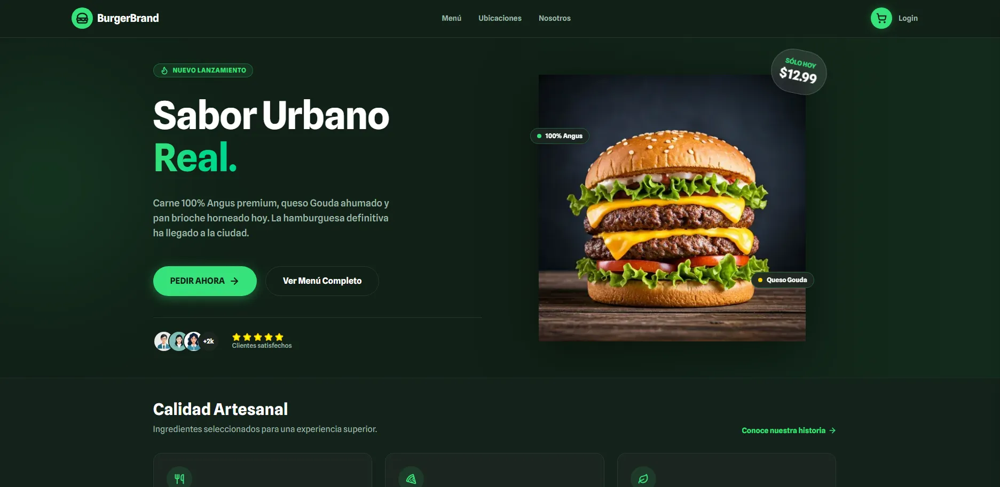
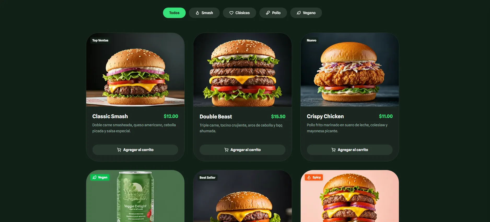
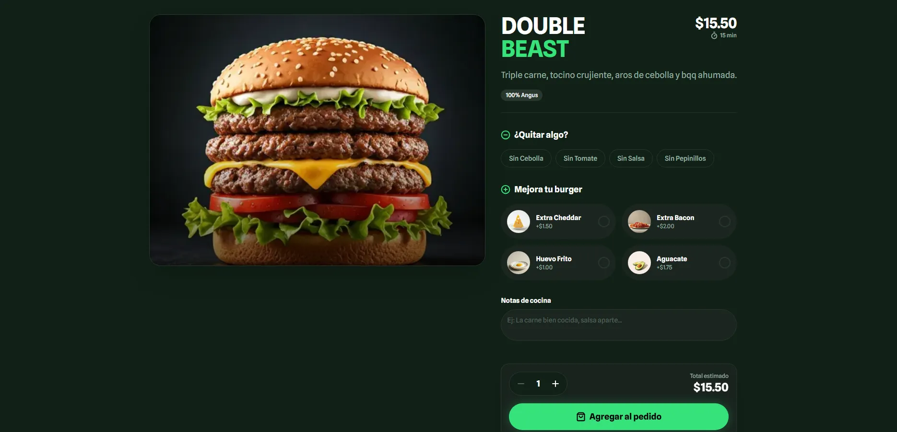
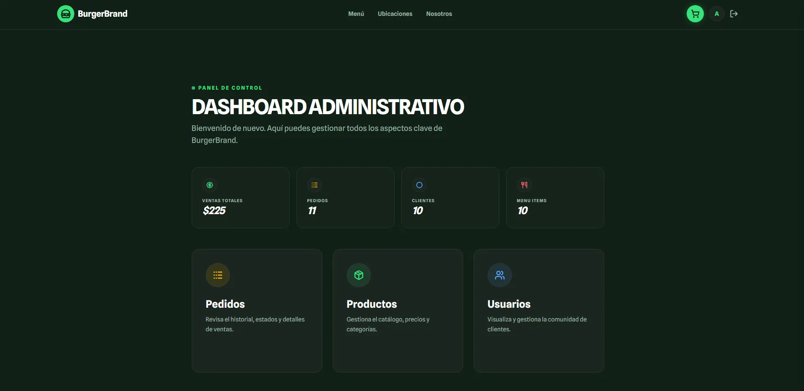
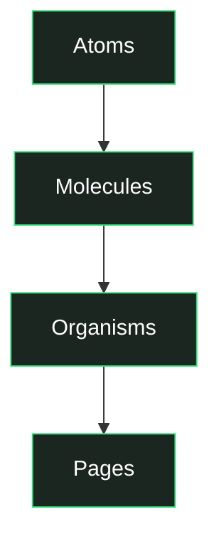

# 🍔 BurgerBrand — Urban Burger Experience



**BurgerBrand** es una plataforma de e-commerce premium diseñada para hamburgueserías artesanales que buscan una experiencia digital de alto impacto. La aplicación combina un diseño visualmente impactante ("Dark Mode" nativo) con una arquitectura robusta y moderna basada en **Next.js 16** y **Tailwind CSS 4**.

---

## ⚡ Características Principales

-   **Menú Dinámico**: Filtrado inteligente por categorías con una interfaz fluida y visual.
-   **Personalización de Productos**: Sistema de "Removibles" para que el cliente ajuste su hamburguesa a gusto.
-   **Carrito de Compras Premium**: Sincronización en tiempo real mediante Zustand y persistencia local.
-   **Panel de Administración**: CRUD completo de catálogo, gestión de usuarios y métricas visuales.
-   **Autenticación Segura**: Implementación robusta con **Supabase Auth** y middleware de protección de rutas.
-   **Diseño Atómico**: Estructura de componentes escalable y mantenible.

---

## 📸 Screenshots

| Home & Experiencia Urbana | Menú & Filtrado |
| :--- | :--- |
|  |  |

| Detalle de Producto | Dashboard Admin |
| :--- | :--- |
|  |  |

---

## 🛠️ Stack Tecnológico

| Capa | Tecnología |
| :--- | :--- |
| **Framework** | Next.js 16 (App Router) |
| **UI Library** | React 19 (React Compiler Ready) |
| **Estilos** | Tailwind CSS 4 (v4 engine) |
| **Estado Global** | Zustand 5 |
| **Backend / Auth** | Supabase |
| **Validación** | Zod 4 + React Hook Form |
| **Iconografía** | Lucide React |

---

## 🏗️ Arquitectura y Estructura

El proyecto sigue una estructura de **Diseño Atómico** y patrones modernos de Next.js para garantizar la escalabilidad:

### 🧩 Diseño Atómico


-   **Atoms**: Elementos mínimos sin dependencias internas (`Badge`, `Button`, `Icon`, `LoadingSpinner`).
-   **Molecules**: Combinaciones de átomos para una función específica (`AdminTable`, `CartSync`, `ProductCard`).
-   **Organisms**: Secciones complejas conectadas a acciones o estado global (`Navbar`, `CartSheet`, `MenuGrid`).
-   **Pages**: Server Components que orquestan la carga de datos.

### 📂 Organización de Carpetas

```bash
app/
├── actions/                  # Next.js Server Actions (Mutaciones y Lógica)
│   ├── admin.ts              # Acciones para gestión de usuarios
│   ├── products.ts           # CRUD de productos (Admin)
│   ├── cart.ts               # Sincronización de carrito con DB
│   ├── orders.ts             # Creación y gestión de pedidos
│   ├── payments.ts           # Integración con pasarela de pagos
│   ├── profile.ts            # Gestión de perfil (User)
│   └── user.ts               # Acciones de sesión y registro
├── admin/                    # Panel de administración (Protegido)
│   ├── products/
│   ├── users/
│   └── orders/
├── about/                    # Historia y valores de la marca
├── checkout/                 # Flujo de orden y pago
├── locations/                # Sedes y horarios
├── login/                    # Acceso de usuarios
├── menu/                     # Página de catálogo completo
├── product/                  # Detalle de producto dinámico [id]
├── profile/                  # Gestión de cuenta y historial
├── globals.css               # Design tokens (@theme) y utilidades
├── layout.tsx                # Root layout (Fuentes, Dark Mode, Providers)
└── page.tsx                  # Home page (Server Component)

components/
├── atoms/                    # Elementos base (Badge, Button, Icon, Spinner)
├── molecules/                # Combinaciones (ProductCard, AdminTable, CartSync)
├── organisms/                # Secciones (Navbar, CartSheet, MenuGrid, ProductModal)
└── providers/                # Context Providers (Auth, Toast, etc.)

lib/
├── data/                     # Data estática (About, Locations)
├── hooks/                    # Hooks personalizados (useHydrated, useCart)
├── schemas/                  # Validaciones Zod (Auth, Checkout, Product)
├── services/                 # Capa de datos directa (Supabase Direct Access)
├── store/                    # Estado global con Zustand (useCartStore)
├── supabase/                 # Configuración de cliente y servidor Supabase
└── types.ts                  # Definiciones de tipos e interfaces globales

public/                       # Assets estáticos (Imágenes, Screenshots, SVGs)
```

---

## 🔄 Flujo de Datos

BurgerBrand utiliza un patrón de datos unidireccional y seguro:

1.  **Direct Database Access**: `lib/services/` consulta directamente a Supabase.
2.  **Business Logic & Validation**: `app/actions/` valida datos con Zod y aplica lógica de negocio.
3.  **UI Rendering**: Los componentes consumen las acciones o datos iniciales.

```text
lib/services/products.ts  →  app/actions/products.ts  →  Componente (Server/Client)
(Acceso directo DB)          (Validación + Mutación)       (Renderizado/Invocación)
```

---

## 📦 Backend & Base de Datos (Supabase)

La infraestructura de datos reside en **Supabase**, utilizando una estrategia de bases de datos relacionales normalizadas.

### ⚠️ Estrategia de Snapshot (Pedidos)
Para garantizar la integridad histórica de los pedidos, BurgerBrand implementa una **Estrategia de Snapshot**:
-   Los pedidos (`orders`) no dependen del catálogo actual de productos.
-   Al crear un pedido, se capturan el nombre y el precio del producto en ese momento exacto en las tablas `order_items`.
-   Esto permite que los cambios de precio o eliminación de productos en el catálogo no afecten el historial contable del usuario.

> [!IMPORTANT]
> Consulta la documentación técnica completa del modelo de datos en: **[DB-SCHEMA-SUPABASE.md](DB-SCHEMA-SUPABASE.md)**

---

## 🚀 Instalación y Desarrollo

1.  **Clonar:** `git clone ...`
2.  **Instalar:** `npm install`
3.  **Variables:** Configurar `.env.local` con credenciales de Supabase.
4.  **Ejecutar:** `npm run dev`

---

**Desarrollado con ❤️ por [Ezequiel Oliver](https://oliver-92.github.io/Portafolio/)**
